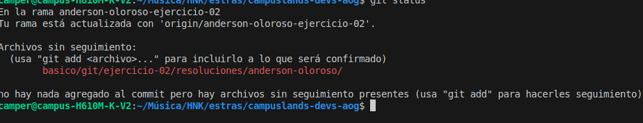

# Ejercicio 02 de resoluciones

## Nombre: _Henrik Anderson Oloroso García_

- Clonacion del repositorio

- Ejecutando git status

- Ejecutando git branch

## Observaciones
Pude observar que al clonar el repositorio, obtuve todos los archivos, al ejecutar git status, me mando una advertencia que ciertos archivos no estan rastreados, en este caso que es este archivo readme, y al ejecutar git branch, pude ver todas las ramas, y pude identificar mi rama actual, la cual es anderson-oloroso-ejercicio-02

